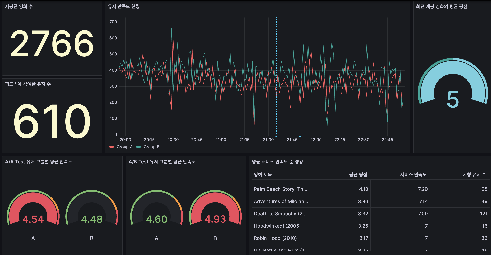

# Movie Recommend

## Scenario

- 당신은 MovieFlix 의 하나뿐인 개발자가 되었습니다.
- 유저들의 원활한 영화관람을 위해 백엔드 개발과 추천시스템 개발을 진행하여야합니다.
- 우리는 A/B Test에만 집중할뿐 A/A Test는 놓치기 쉽다고 합니다.
- 하여 MovieFlix는 A/B Test를 통해 대조 실험을 하기전 A/A Test를 통해 두그룹을 먼저 살펴보려 합니다.
    - 이번 프로젝트는 [방태모님](https://www.linkedin.com/in/taemo)의 데이터야 놀자 발표에 영감을 받아 제작하였습니다.

## Architecture

<p align="center">
  
</p>

## Final Visualization

<p align="center">
  
</p>

- `그룹별 평균 만족도 점수` 차트 혹은 `유저 만족도 현황` 차트를 보았을 때 A/B Test에서 B그룹 만족도가 개선
- 우리의 추천시스템이, 서비스가 잘 작동하고 있구나를 모니터링

### Infra

- [Infra](https://github.com/ehddnr301/MovieRecommend-Infra)
- VM관리 및 개발환경관리를 terraform과 ansible을 통해 하게됩니다.

### K8s

- [K8s](https://github.com/ehddnr301/MovieRecommend-K8s)
- 사용되는 모든 App들을 kubernetes위에서 관리하게 됩니다.

### Client

- `project/client`
- 유저 행동부분을 담당하는 코드부분입니다.
- 가상의 시나리오는 아래와 같습니다.
    ```plain
        1. 영화가 개봉 (send_movie_data = Movie 데이터 생성)
        2. 앞서 1에서 개봉한 영화를 보러 사람들이 방문
            2-1. ratings.csv에 해당 movie_id가 존재하는 유저 추출 (find_user_list_from_ratings)
            2-2. 해당 유저들에 한하여 ratings 데이터와 feedbacks 데이터 생성 (send_user_reaction)
    ```

### FastAPI

- `project/fastapi`
- 백엔드 서비스를 담당하는 코드부분입니다.
- Client 코드에서 생성되는 Request를 통해 데이터를 생성합니다.
- Feedback데이터를 통해 현재 서비스 만족도롤 평가합니다.
    - 9개의 영화를 추천해 유저가 이번에 보려는 영화가 앞쪽에 위치할수록 점수가 높게 됩니다.

### Kafka

- `project/kafka`
- Lambda Data Architecture에서 Speed Layer 부분을 Kafka Connector를 통해 구현하였습니다.

### Airflow

- [Airflow-Dags](https://github.com/ehddnr301/MovieRecommender-DAGs)
- Lambda Data Architecture에서 Batch Layer 부분을 처리하기 위한 Dag이 존재합니다.
- json파일을 통해 동적으로 Dag을 생성하게 됩니다.
- git-sync를 통해 위 repository에 정의된 Dag을 사용하게 됩니다.
- 간단한 머신러닝 Dag도 담겨있습니다.

### Grafana

- 시각화 용도로 사용되었습니다.

### MLFlow

- 모델 Registry 용도로 사용되었습니다.

### Minio

- MLflow의 아티팩트 스토리지를 위해 사용되었습니다.
