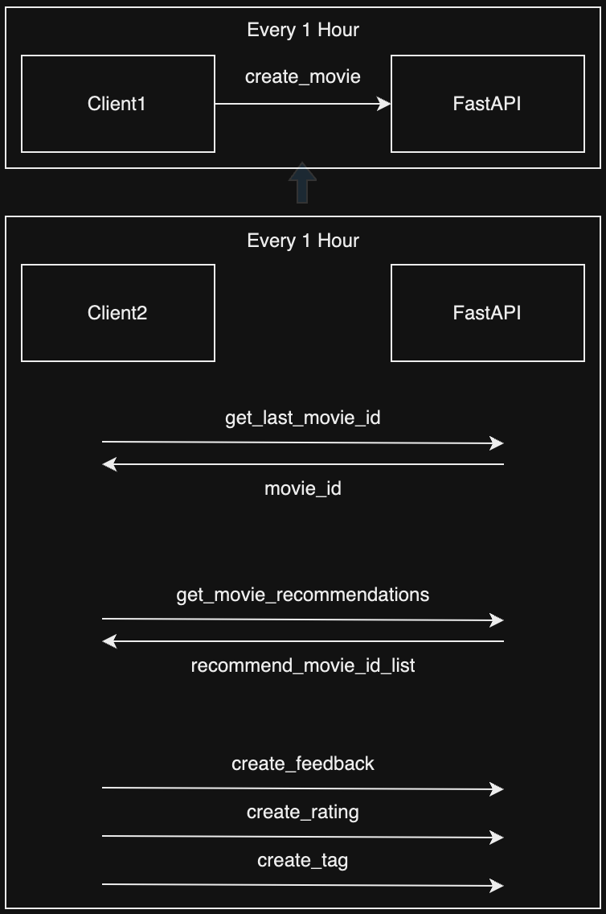

# FastAPI

- 추천시스템에 필요한 최소한의 기능만 구현하였습니다.

## 설명

### 영화

- 영화는 매 한시간 마다 movielens 데이터중 랜덤하게 골라 생성됩니다. (=`새로운 영화 개봉`)

### 추천시스템 동작

- `마지막으로 개봉한 영화ID`를 가져옵니다.
- movielens 데이터에 `해당 영화`를 본 유저만 뽑아 추천모델을 통해 recommend_movie_id_list 를 받습니다.
    - 접속한 모든 유저에 대해 추천을 해주어야 하지만 편의상 해당 유저들이 접속했다고 `가정`
- 받은 추천 영화 목록에 대해서 평점, 태그, 피드백을 생성합니다.